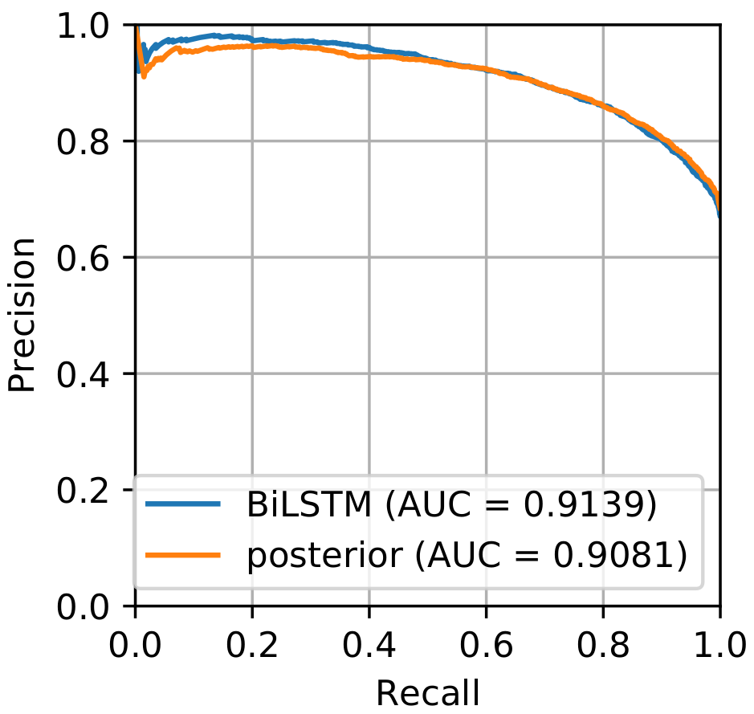
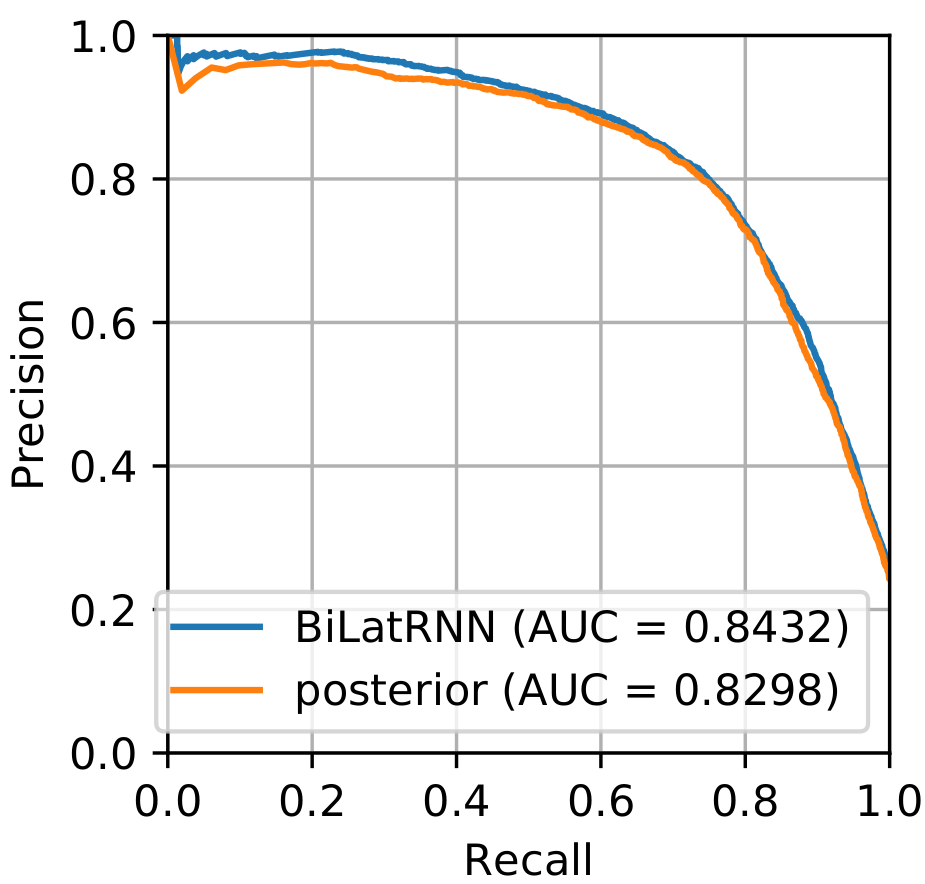

# Confidence Estimation for Black Box Automatic Speech Recognition Systems Using Lattice Recurrent Neural Networks
### Uncertainty and confidence scores in sequence data

This repo provides mechanisms for confidence estimates to be generated for black box Automatic Speech Recognition (ASR) systems. Furthermore, the code allows subword level information to be introduced into Bi-directional Lattice Recurrent Neural Networks (BiLatticeRNN). BiLatticeRNN is a generalisation of a BiLSTM to DAG-like structures, such as lattice and confusion networks, which enables information from competing transciptions to be used to enhance confidence estimation. We used this framework to generate confidence score estimates for each word in the  lattice, confusion network, or one-best list. This is incredibly useful for ASR applications such as information retrieval, deletion detection, and machine translation. Improvements in Normalised Cross Entropy (NCE) and AUC (Precision-Recall) over to the traditional word posterior confidence score estimates are furthered by including grapheme features, such as duration and a grapheme embedding.

One-best sequences                  |  Confusion Networks
:------------------------------:|:------------------------------:
  |  

These results were generated on the CUED graphemic Georgian ASR system which was trained on the Georgian language pack from the BABEL project.

The paper, Confidence Estimation for Black Box Automatic Speech Recognition Systems Using Lattice Recurrent Neural Networks, used this framework and further documents the use of this model for black-box ASR. If you use this code, please cite:

*  A. Kastanos, A. Ragni, M.J.F. Gales, Confidence Estimation for Black Box Automatic Speech Recognition Systems Using Lattice Recurrent Neural Networks, in Proc. ICASSP, 2020 [[arXiv]](https://arxiv.org/abs/1910.11933)


You can also find more information on this topic in my [thesis](https://alecokas.github.io/PDFs/thesis/Uncertainty_and_Confidence_Scores_in_Sequence_Data.pdf) and [website](https://alecokas.github.io/).

This code is an extension of [Bi-Directional Lattice Recurrent Neural Networks for Confidence Estimation](https://arxiv.org/abs/1810.13024).

## Usage

### Dependencies

* python 3.6.3
* pytorch 0.3.1
* numpy 1.14.0
* matplotlib 2.1.2
* scikit-learn 0.19.1
* tqdm 4.19.5

### Commands

To train the model on CUED servers,

```bash
export PYTHONPATH=$PYTHONPATH:$PWD
OMP_NUM_THREADS=1 python main.py [arguments]
```

For detailed options,

```bash
python main.py --help
```

Note that the environment variable `OMP_NUM_THREADS=1` is essential for CPU parallelisation.

## Dataset

This repository assumes a root directory with pre-processed data organised as follows:

```plaintext
root/
  |
  |-- data/
  |     |
  |     |-- lattices/
  |     |-- target/ (or target_overlap_XX for overlap specific targets)
  |     |   train.txt
  |     |   train_debug.txt (if in debug mode)
  |     |   cv.txt
  |     |   test.txt
  |     |   stats.npz
```

See https://github.com/alecokas/BiLatticeRNN-data-processing for assorted HTK-style lattice and confusion network processing.

In the `data/` directory:

* `lattices/` contains the pre-processed data structures from one-best sequences, or confusion networks, or lattices, which are stored as [zipped archive files](https://docs.scipy.org/doc/numpy-1.14.0/reference/generated/numpy.savez.html) by numpy with suffix `.npz`. Each one has the following attributes:
  * `topo_order` - a list of node indices that follows a topological order;
  * `child_2_parent` - a dictionary that maps from a node index to a dictionary, whose key is the index of the parent node and the value is the index of the connecting edge for lattices or a list indices of the connecting edges for confusion networks. This is used for the forward recursion;
  * `parent_2_child` – a dictionary that maps from a node index to a dictionary, whose key is the index of the child node and the value is the index of the connecting edge for lattices or a list indices of the connecting edges for confusion networks. This is used for the backward recursion;
  * `edge_data` – a numpy 2D array (matrix) containing all relevant information from the source file where the row index is the edge index. For an arc in a lattice, the information could include the word, duration, LM and AM scores, and the arc posterior probability. For an arc in a confusion network, the arc posterior probability, the start and the end time should be available;
  * `ignore` – a list of edge indices whose corresponding word is one of the following `<s>, </s>, !NULL, <hes>`, which are due to be skipped during training of the network.
  * `grapheme_data` - a numpy array of arrays containing grapheme information in the form of a 4D grapheme embedding and the grapheme durations.
  * `start_times` – a start time (in seconds) of each arc.

* `target/` contains the pre-processed training targets which correspond to the ones in `lattices/`. They are also stored in `.npz` format. Each one has the following attributes:
  * `target` - a list of target confidence scores for each arc in the corresponding lattice, with each element being either 0(incorrect) or 1(correct);
  * `indices` - a list of arc indices on one-best sequences in the structure;
  * `ref` - a list of target confidence scores on one-best sequences.

* `*.txt` stores the absolute paths of data where each line corresponds to one sample in `lattices/` directory.

* `stats.npz` stores the statistics of the input feature, which is used for data normalisation upon loading. It has the following attributes:
  * `mean` - the mean of input feature vectors across the dataset;
  * `std` - the standard deviation of input feature vectors across the dataset.

### References for BiLatticeRNN on word-based lattices

```plaintext
@misc{alex2019confidence,
    title={Confidence Estimation for Black Box Automatic Speech Recognition Systems Using Lattice Recurrent Neural Networks},
    author={Alexandros Kastanos and Anton Ragni and Mark Gales},
    year={2019},
    eprint={1910.11933},
    archivePrefix={arXiv},
    primaryClass={eess.AS}
}

@article{Li2018BiLatRNN,
  title={Bi-Directional Lattice Recurrent Neural Networks for Confidence Estimation},
  author={Li, Qiujia and Ness, Preben and Ragni, Anton and Gales, Mark},
  journal={arXiv preprint arXiv:1810.13024},
  year={2018}
}

@inproceedings{Ragni2018Confidence,
  title={Confidence Estimation and Deletion Prediction Using Bidirectional Recurrent Neural Networks},
  author={Ragni, Anton and Li, Qiujia and Gales, Mark and Wang, Yu},
  booktitle={SLT},
  year={2018}
}
```

