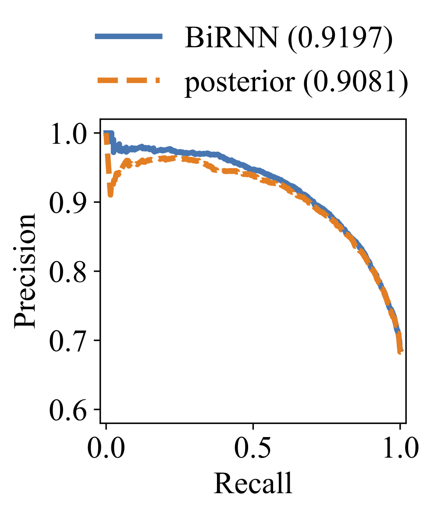
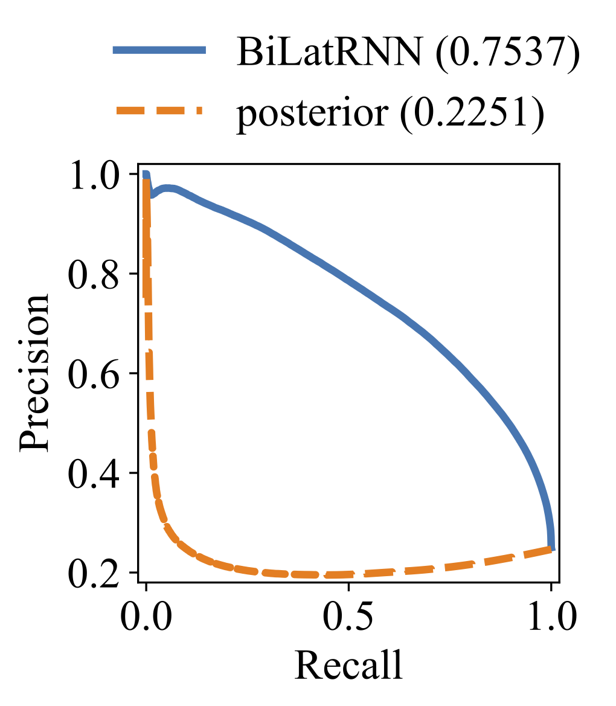

# Bi-directional Lattice Recurrent Neural Networks for Confidence Estimation

This repository is the code used in our paper:

>**[Bi-Directional Lattice Recurrent Neural Networks for Confidence Estimation](https://arxiv.org/abs/1810.13024)**
>
>*Qiujia Li\*, Preben Ness\*, Anton Ragni, Mark Gales* (\* indicates equal contribution)
>
>Submitted to ICASSP 2019

## Model

In short, this model is an extension of classical LSTM network that runs on linear sequences to **BiCNRNN** that runs on *confusion networks* (a.k.a. sausages) or **BiLatRNN** that runs on *lattices*.

This allows intermediate information produced by the speech recogniser to be fully utilised to predict not only confidence scores on one-best sequences, but on all alternative word hypotheses, which are useful in many confidence-related tasks.

The model gives significant improvement on confidence scores. Precision-recall curves are shown below.

one-best paths                  |  lattices
:------------------------------:|:------------------------------:
  |  

For more details, please refer to the [paper](https://arxiv.org/pdf/1810.13024.pdf) or the [thesis](http://liqiujia.com/papers/meng_thesis.pdf).

## Usage

### Dependencies

* python 3.6.3
* pytorch 0.3.1
* numpy 1.14.0
* matplotlib 2.1.2
* scikit-learn 0.19.1
* tqdm 4.19.5

### Commands

To train the model,

```bash
OMP_NUM_THREADS=1 python3 main.py
```

For detailed options,

```bash
python3 main.py --help
```

Note that the environment variable `OMP_NUM_THREADS` is essential for CPU parallelisation.

## Data Pre-processing

This repository assumes a root directory with pre-processed data organised as follows:

```plaintext
root/
  |
  |-- data/
  |     |
  |     |-- lattices/
  |     |-- target/
  |     |   train.txt
  |     |   train_debug.txt (if in debug mode)
  |     |   cv.txt
  |     |   test.txt
  |     |   stats.npz
  |
  |-- exp/
  |     |-- (saved models)
  |     |-- ...
```

In the `data/` directory:

* `lattices/` contains the pre-processed data structures from one-best sequences, or confusion networks, or lattices, which are stored as [zipped archive files](https://docs.scipy.org/doc/numpy-1.14.0/reference/generated/numpy.savez.html) by numpy with suffix `.npz`. Each one has the following attributes:
  * `topo_order` - a list of node indices that follows a topological order;
  * `child_2_parent` - a dictionary that maps from a node index to a dictionary, whose key is the index of the parent node and the value is the index of the connecting edge for lattices or a list indices of the connecting edges for confusion networks. This is used for the forward recursion;
  * `parent_2_child` – a dictionary that maps from a node index to a dictionary, whose key is the index of the child node and the value is the index of the connecting edge for lattices or a list indices of the connecting edges for confusion networks. This is used for the backward recursion;
  * `edge_data` – a numpy 2d array (matrix) containing all relevant information from the source file where the row index is the edge index. For an arc in a lattice, the information could include the word, the start time and the end time, LM and AM scores. For an arc in a confusion network, the arc posterior probability, the start and the end time should be available;
  * `ignore` – a list of edge indices whose corresponding word is one of the following `<s>, </s>, !NULL, <hes>`, which are due to be skipped during training of the network.

* `target/` contains the pre-processed training targets which correspond to the ones in `lattices/`. They are also stored in `.npz` format. Each one has the following attributes:
  * `target` - a list of target confidence scores for each arc in the corresponding lattice, with each element being either 0(incorrect) or 1(correct);
  * `indices` - a list of arc indices on one-best sequences in the structure;
  * `ref` - a list of target confidence scores on one-best sequences.

* `*.txt` stores the absolute paths of data where each line corresponds to one sample in `lattices/` directory.

* `stats.npz` stores the statistics of the input feature, which is used for data normalisation upon loading. It has the following attributes:
  * `mean` - the mean of input feature vectors across the dataset;
  * `std` - the standard deviation of input feature vectors across the dataset.

## References

```plaintext
@article{Li2018BiLatRNN,
  title={Bi-Directional Lattice Recurrent Neural Networks for Confidence Estimation},
  author={Li, Qiujia and Ness, Preben and Ragni, Anton and Gales, Mark},
  journal={arXiv preprint arXiv:1810.13024},
  year={2018}
}

@inproceedings{Ragni2018Confidence,
  title={Confidence Estimation and Deletion Prediction Using Bidirectional Recurrent Neural Networks},
  author={Ragni, Anton and Li, Qiujia and Gales, Mark and Wang, Yu},
  booktitle={SLT},
  year={2018}
}
```

